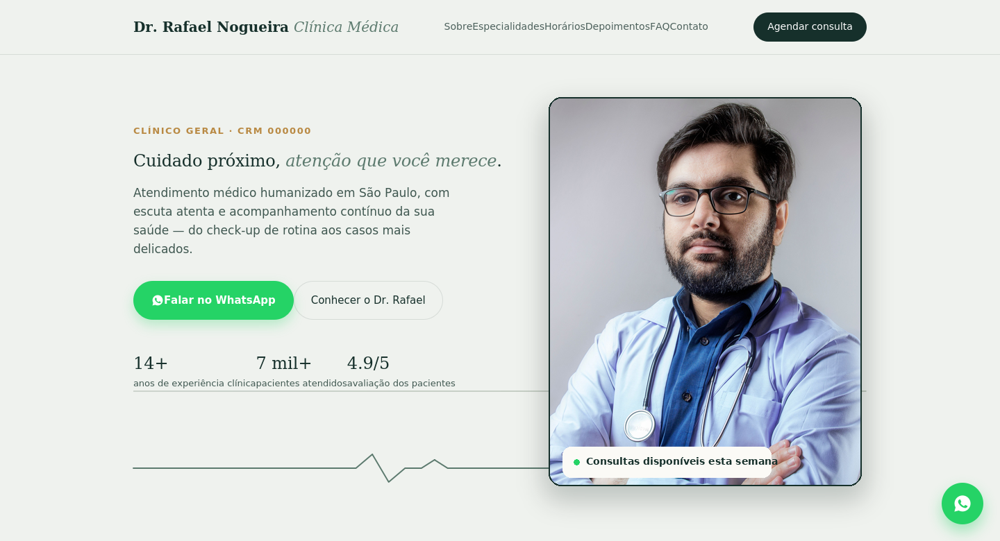

# Site Médico — Dr. Rafael Nogueira (modelo)

Landing page para profissionais de medicina, feita para converter visitantes em agendamentos via WhatsApp. Este projeto é um modelo de demonstração — todos os dados (nome, CRM, endereço, contatos) são fictícios.

🔗 **Site no ar:** https://gabrielbtaa.github.io/site-dr-rafael-nogueira/

## O que tem no site

- Design clean e responsivo, com transições suaves ao rolar a página
- Botão de WhatsApp fixo + integração com Google Calendar para agendamento
- Aba de horários de atendimento
- Google Maps incorporado na seção de contato
- Seção de perguntas frequentes (FAQ)
- Banner de cookies em conformidade com a LGPD, com política de privacidade
- SEO técnico: meta tags Open Graph, dados estruturados (JSON-LD para `Physician` e `FAQPage`), `sitemap.xml`, `robots.txt` liberando crawlers de IA (GPTBot, ClaudeBot, PerplexityBot) e `llms.txt`
- Favicon próprio
- Site inteiro em um único arquivo HTML (imagens embutidas), fácil de hospedar em qualquer lugar

## Tecnologias

HTML, CSS e JavaScript puros — sem frameworks, sem build, sem dependências. Carrega rápido e funciona em qualquer hospedagem estática (GitHub Pages, Vercel, Netlify).

## Sobre este projeto

Este site foi criado como peça de portfólio para prospecção de clientes na área de saúde e estética. Se você é médico(a), dentista, ou tem uma clínica de estética e quer um site assim para o seu negócio, entre em contato.

---
*Desenvolvido por Gabriel — [GitHub](https://github.com/GabrielBtaa)*
